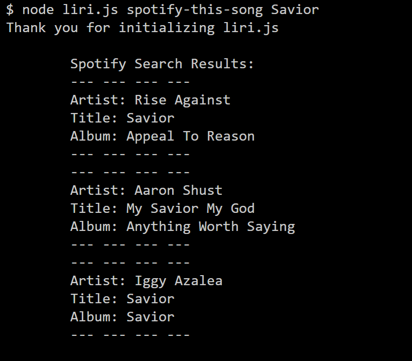
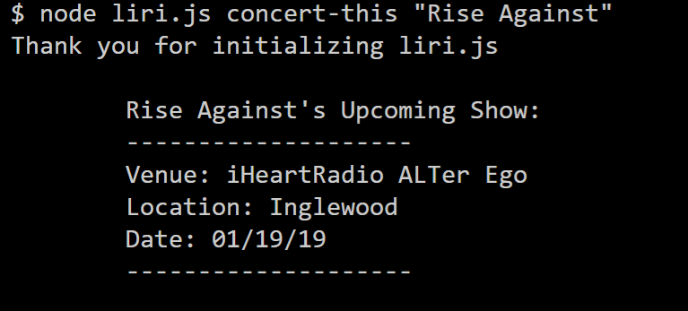
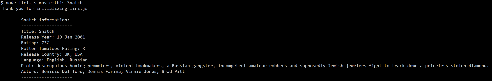
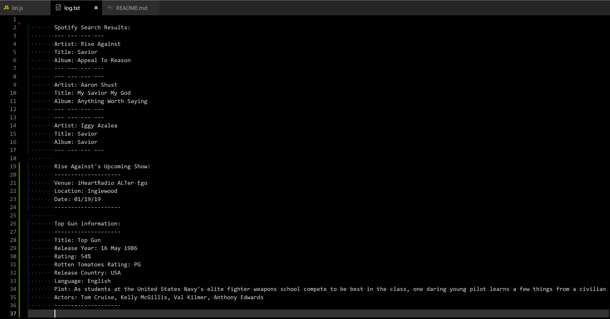

# liri-node-app
Welcome to the Language Interpretation and Recognition Interface application!

This application allows a user to enter particular command-line direction to complete three separate tasks:
  1.) Search Spotify for a particular song title (spotify-this-song)
  2.) Search Bands In Town for a particular artist's upcoming show (concert-this)
  3.) Search the Online Movie Data Base for information on a particular movie (movie-this)

The commands are entered as follows:
Spotify:

Bands In Town:

Online Movie Data Base:

And return, respectively:

Spotify:

Bands In Town:

Online Movie Data Base:

All results are logged into log.txt, as shown here:
Log.txt:

